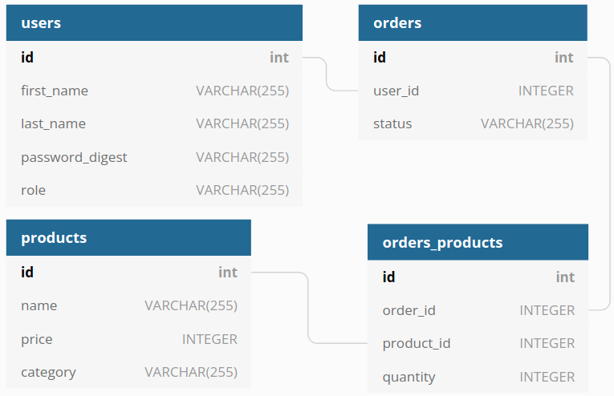

# API Requirements
The company stakeholders want to create an online storefront to showcase their great product ideas. Users need to be able to browse an index of all products, see the specifics of a single product, and add products to an order that they can view in a cart page. You have been tasked with building the API that will support this application, and your coworker is building the frontend.

## API Endpoints
#### Products
- Index
- Show
- Create [token required] [role: admin]
- Update [token required] [role: admin]
- Delete [token required] [role: admin]

#### Users
- Index [token required] [role: admin]
- Show [token required] [role: admin]
- Create [token required] [role: admin]
- Authenticate
- Update [token required] [role: admin, user_id: own_user]
- Delete [token required] [role: admin, user_id: own_user]

#### Orders
- Index [token required] [role: admin]
- Show [token required] [role: admin]
- Create [token required] [role: admin]
- Add products to order [token required] [role: admin, user_id: own_user]
- Update products to order [token required] [role: admin, user_id: own_user]
- Update order [token required] [role: admin, user_id: own_user]
- Current Order by user [token required] [role: admin, user_id: own_user]
- Completed Orders by user [token required] [role: admin, user_id: own_user]
- Delete [token required] [role: admin]

## API Data Shapes
#### Product
- id: number
- name: string
- price: number (cents)
- category: string

#### User
- id: number
- firstName: string
- lastName: string
- password_digest: string
- role (admin or user): string

#### Orders
- id: number
- id of each product in the order: array of numbers
- quantity of each product in the order: array of numbers
- user_id: number
- status of order (active or complete): string

## Database Relationship

