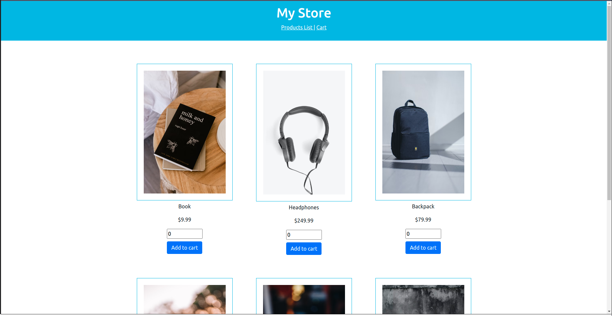

# MyStore

- [MyStore](#mystore)
  - [About The Project](#about-the-project)
  - [Built With](#built-with)
  - [Getting Started](#getting-started)
    - [Prerequisites](#prerequisites)
    - [Installation](#installation)
    - [Starting server:](#starting-server)
  - [License](#license)

## About The Project




MyStore is Angular application that allows users to view a list of available products to purchase, details of products, add them to a shopping cart, and ultimately complete the checkout process.

* In product list view is possible to view all products available and add to cart.
* In product detail view is possible to view product description and add to cart.
* In cart view is possible to check total price, change quantity of a product, remove a product and place an order.
* In confirmation view is possible to see order details, such as full name of buyer and total value of order.

## Built With

* [Angular](https://angular.io/)
* [TypeScript](https://www.typescriptlang.org/)
* [Bootstrap](https://getbootstrap.com)
* [Node.js with TypeScript](https://nodejs.dev/learn/nodejs-with-typescript)

## Getting Started

### Prerequisites

This project was developed using:
- Node: v16.13.0
- Angular: 13.0.3
- Angular CLI: 13.0.4

### Installation

1. Clone the repo
   ```sh
   git clone https://github.com/rodrigodias27/udacity-js-projects.git
   ```
2. Go to project folder
   ```sh
   cd <folder_where_you_cloned>/udacity-js-projects/03-angular-fundamentals-store/my-store
   ```
3. Install NPM packages
   ```sh
   npm install
   ```

### Starting server:

- Starting serve on port 3000
  ```bash
  ng serve --port=3000
  ```

## License

[License](../../LICENSE.txt)
